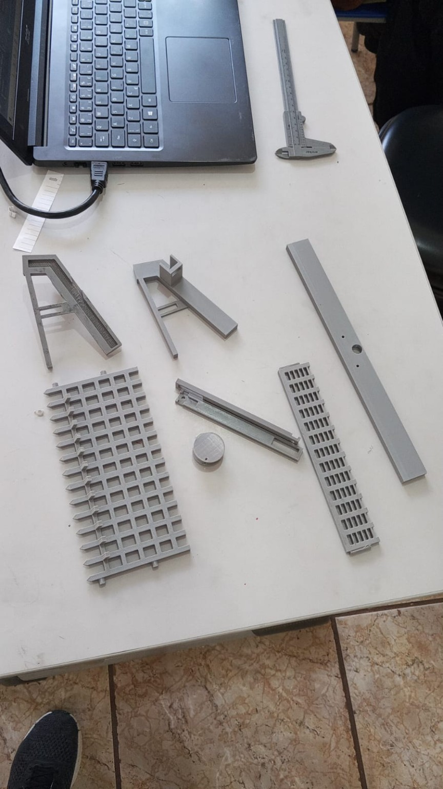
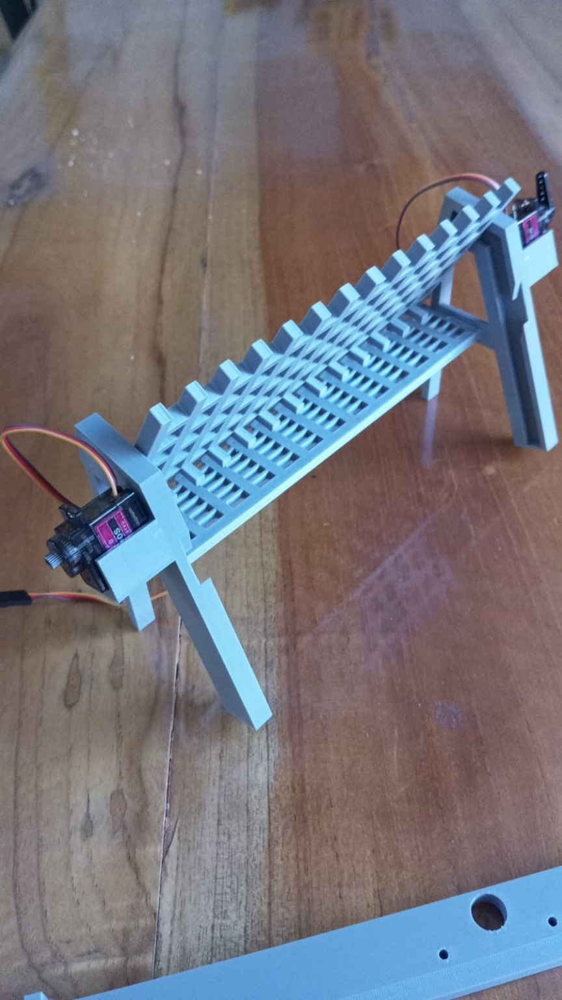
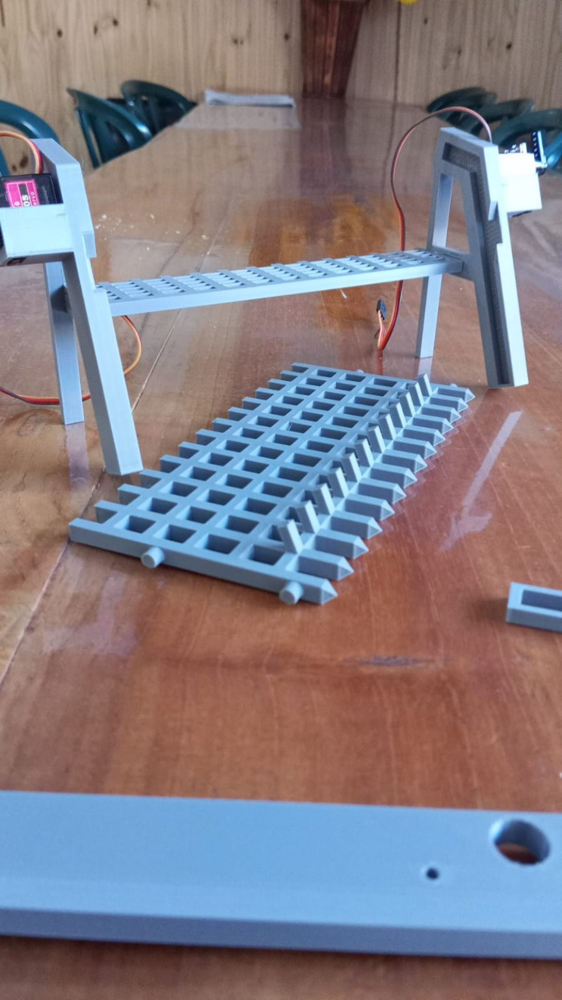

<div align="center">

# 🌊 WaterCleaner Autoalimentado

### Protótipo robótico para direcionar e coletar resíduos flutuantes

**Robótica educacional · Automação · Impressão 3D · Sustentabilidade**

</div>

---

## Sobre o projeto

O **WaterCleaner Autoalimentado** é um projeto de robótica educacional desenvolvido no contexto do **Agrinho 2026**. A proposta é criar um sistema que ajude a conter e direcionar resíduos flutuantes em cursos d'água, unindo modelagem e fabricação digital, eletrônica e programação.

O protótipo combina uma estrutura mecânica impressa em 3D com servos e um motor de passo. O código em Arduino usa um sensor ultrassônico para detectar a aproximação de um objeto e acionar o mecanismo.

> O aproveitamento do fluxo da água como fonte de energia faz parte da proposta do projeto. A geração e a autonomia energética ainda não estão demonstradas pelo código disponível neste repositório.

## O protótipo

<div align="center">
  
</div>

*Estrutura montada com componentes impressos em 3D.*

<details>
  <summary>Ver peças impressas e outra perspectiva do protótipo</summary>
  <br>
  
  
</details>

## Como funciona

O sketch monitora continuamente a leitura do sensor ultrassônico. Quando o valor lido fica abaixo de **15**, o Arduino executa um ciclo que movimenta o motor de passo e altera gradualmente a posição dos dois servos. A sequência foi concebida para movimentar o mecanismo de coleta.

```text
Sensor ultrassônico
        │
        ▼
Leitura abaixo de 15
        │
        ▼
Servos inclinam gradualmente
e motor de passo sobe
        │
        ▼
Pausa de 2 segundos
        │
        ▼
Motor desce e servos retornam
```

O funcionamento está implementado em [`AGRINHO_2026.ino`](./AGRINHO_2026/AGRINHO_2026/AGRINHO_2026.ino). O limite de detecção, os ângulos dos servos e a quantidade de passos podem ser ajustados no código conforme os testes do mecanismo.

## Componentes e conexões

| Componente | Pino(s) no Arduino | Função |
| --- | --- | --- |
| Sensor ultrassônico | TRIG: 4 · ECHO: 3 | Detectar a aproximação de objetos |
| Servo esquerdo | 11 | Movimentar o mecanismo |
| Servo direito | 12 | Movimentar o mecanismo |
| Motor de passo | 10, 9, 6, 5 | Acionar o mecanismo de subida e descida |

O motor de passo está configurado para **15 rpm** no sketch. A fiação e a alimentação devem seguir as especificações dos componentes utilizados no protótipo.

## Código e execução

O código está na pasta [`AGRINHO_2026/AGRINHO_2026`](./AGRINHO_2026/AGRINHO_2026/).

1. Abra `AGRINHO_2026.ino` na Arduino IDE.
2. Selecione a placa e a porta serial corretas.
3. Instale uma biblioteca compatível com `Ultrasonic.h`, caso ainda não esteja disponível na IDE. `Servo` e `Stepper` são incluídas com a plataforma Arduino.
4. Confira as conexões e envie o sketch para a placa.
5. Use o Monitor Serial a **9600 baud** para acompanhar os valores lidos pelo sensor.

O sketch também inclui `arduino_secrets.h`; mantenha esse arquivo junto do projeto ao compilar.

## Modelagem e fabricação digital

O repositório inclui o modelo [`watercleaner.stl`](./modelos/watercleaner.stl) e fotografias das peças impressas em [`docs/imagens/`](./docs/imagens/). A impressão 3D permite produzir componentes personalizados e ajustar o projeto entre ciclos de montagem e teste.

## Vídeos

- [Vídeo do protótipo — parte 1](./docs/videos/prototipo-parte-1.mp4)
- [Vídeo do protótipo — parte 2](./docs/videos/prototipo-parte-2.mp4)

## Objetivos educacionais

O desenvolvimento do projeto permite explorar conceitos de:

- robótica, eletrônica e programação;
- mecanismos, movimento e transmissão;
- modelagem 3D e prototipagem;
- sustentabilidade e educação ambiental;
- experimentação, testes e melhoria de protótipos.

## Próximas etapas

- testar o mecanismo com resíduos simulados e registrar os resultados;
- avaliar a estrutura em condições controladas antes de qualquer uso em cursos d'água;
- documentar o sistema de geração e armazenamento de energia, se implementado;
- investigar sensores ambientais e monitoramento remoto;
- aprimorar a separação e o armazenamento dos resíduos coletados.

## Contexto

Projeto desenvolvido no contexto do **Agrinho 2026**, relacionando robótica educacional, inovação e sustentabilidade.

<div align="center">

### 🌊🤖 Tecnologia para cuidar dos rios

</div>
